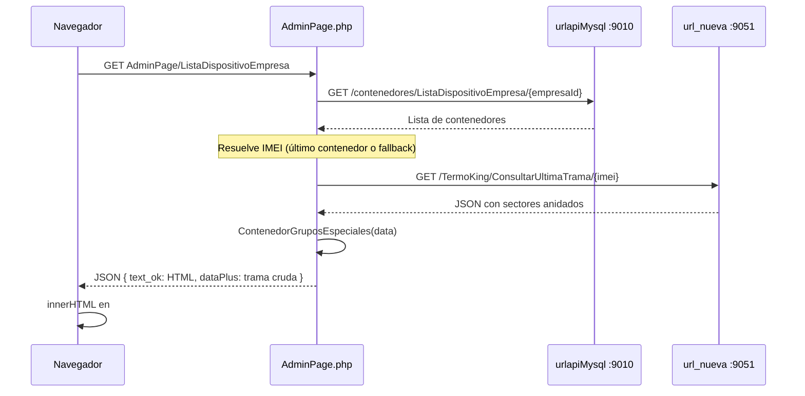

# Funcionamiento del dashboard Cerro Prieto

Documentación de cómo la interfaz obtiene, divide y muestra los datos de los cinco sectores del panel principal (AdminPage).

**Dispositivo de referencia:** IMEI `860389053949943` (RIPENER)  
**Consulta en vivo realizada:** `GET http://161.132.53.51:9051/TermoKing/ConsultarUltimaTrama/860389053949943`

---

## 1. Arquitectura general

El proyecto es una aplicación **PHP full-stack** con dashboard renderizado en servidor e inyección en el navegador.



### Archivos clave

| Archivo | Rol |
|---------|-----|
| `Controllers/AdminPage.php` | Orquesta lista de dispositivos + trama + respuesta JSON |
| `Models/AdminPageModel.php` | Llamadas HTTP con cURL a APIs externas |
| `Config/Funciones/generales.php` | Mapeo API → HTML por sector |
| `Assets/js/AdminPage.js` | Carga inicial: inyecta `text_ok` en `#contenidoExtra` |
| `Config/Config.example.php` | URLs y IMEI por defecto |

### URLs configuradas

| Constante | Variable `.env` | Valor por defecto |
|-----------|-----------------|-------------------|
| `url_nueva` | `URL_NUEVA` | `http://161.132.53.51:9051` |
| `urlapiMysql` | `URLAPI_MYSQL` | `http://161.132.206.104:9010` |
| `cerro_prieto_series_imei` | `CERRO_PRIETO_SERIES_IMEI` | `860389053949943` |

---

## 2. Endpoint principal de telemetría

```
GET {url_nueva}/TermoKing/ConsultarUltimaTrama/{imei}
```

Implementado en `AdminPageModel::ConsultarUltimaTrama()`.

La respuesta tiene la forma:

```json
{
  "code": 200,
  "message": "Datos recuperados exitosamente.",
  "data": {
    "imei": "860389053949943",
    "device": "RIPENER",
    "fecha": "2026-06-30T23:56:19.213000",
    "power_state": 1,
    "set_point": 20.0,
    "temp_supply_1": 20.0,
    "return_air": 20.3,
    "ambient_air": 23.4,
    "power_kwh": 2196.6,
    "line_voltage": 451.0,
    "atmosfera_controlada": { "ac_1": 0.0, "ac_2": 5.0, "...": "..." },
    "starcool_cerro_prieto": { "st_1": 0.0, "st_2": 0.5, "...": "..." },
    "madurador": { "mad_1": 196.6, "mad_2": 200.0, "...": "..." },
    "inyectores": { "in1_1": 0, "in1_5": 1, "...": "..." }
  }
}
```

### Resolución del IMEI

En `AdminPage::ListaDispositivoEmpresa()` el IMEI se obtiene en este orden:

1. Campo `imei` o `IMEI` del **último** contenedor devuelto por `ListaDispositivoEmpresa`
2. Constante `cerro_prieto_series_imei` / env `CERRO_PRIETO_SERIES_IMEI`
3. Fallback hardcodeado: `860389053949943`

### Flujo en el navegador

1. Al cargar AdminPage, `AdminPage.js` llama a `AdminPage/ListaDispositivoEmpresa`
2. PHP consulta la trama y genera HTML con `ContenedorGruposEspeciales($dataPlus)`
3. El HTML llega en el campo `text_ok` del JSON
4. JavaScript lo inserta en `#contenidoExtra`

**Importante:** Las cinco tarjetas de sectores **no se actualizan en tiempo real**. Solo se generan en la carga inicial. El polling cada 30 s (`AdminPage/LiveData`) actualiza otra vista legacy oculta (`#contenidoPrincipal`).

---

## 3. División de datos en la interfaz

La función `ContenedorGruposEspeciales()` en `generales.php` divide la trama en bloques:

```
data (ConsultarUltimaTrama)
├── Cabecera (device, imei, power_state, fecha)
├── Parámetros Principales ← campos de nivel raíz
├── atmosfera_controlada → Tarjeta "Atmósfera Controlada"
├── starcool_cerro_prieto → Tarjeta "Starcool Cerro Prieto"
├── madurador → Tarjeta "Sistema Madurador" (clásico o PLUS)
└── inyectores → Tarjeta "Sistema de Inyectores"
```

Cada tarjeta solo se renderiza si la clave correspondiente existe en la respuesta (`isset($val->atmosfera_controlada)`, etc.).

Los mapeos campo → etiqueta están **hardcodeados** en arrays PHP dentro de `generales.php` (no hay archivo JSON de configuración externo).

---

## 4. Parámetros Principales

### Origen en la API

Campos en el **nivel raíz** de `data`, no dentro de un objeto anidado.

### Función de renderizado

`generarParametrosPrincipales($val)` dentro de `ContenedorGruposEspeciales()`.

### Mapeo API → UI

| Etiqueta UI | Campo API | Formateo |
|-------------|-----------|----------|
| Set Point | `set_point` | `formatearTemperatura()` → `"X.X°C"` |
| Supply Air | `temp_supply_1` | `formatearTemperatura()` |
| Return Air | `return_air` | `formatearTemperatura()` |
| Ambient | `ambient_air` | `formatearTemperatura()` |
| Power KWH | `power_kwh` | `formatearNumero(..., ' kWh')` |
| Voltage | `line_voltage` | `formatearNumero(..., ' V')` |

Valores `null`, `E01` o `E00` se muestran como **N/A**.

### Ejemplo real (trama consultada vs pantalla)

| Campo API | Valor API | Valor en UI |
|-----------|-----------|-------------|
| `set_point` | `20.0` | **20.0°C** |
| `temp_supply_1` | `20.0` | **20.0°C** |
| `return_air` | `20.3` | **20.3°C** |
| `ambient_air` | `23.4` | **23.4°C** |
| `power_kwh` | `2196.6` | **2,196.6 kWh** |
| `line_voltage` | `451.0` | **451.0 V** |

La cabecera del panel usa además:

| Elemento cabecera | Campo API | Regla |
|--------------------|-----------|-------|
| Nombre dispositivo | `device` | Texto directo → "RIPENER" |
| IMEI | `imei` | Texto directo |
| POWER ON/OFF | `power_state` | `1` → ON (verde), `0` → OFF (rojo) |
| Fecha/hora | `fecha` | `formatearFecha_Plus()` → `dd/mm/yyyy HH:mm:ss` |

---

## 5. Atmósfera Controlada

### Origen en la API

Objeto anidado: `data.atmosfera_controlada` con claves `ac_1` … `ac_16`.

### Función de renderizado

`generarTarjetaAtmosferaControlada($val->atmosfera_controlada)`.

### Mapeo completo

| Clave API | Etiqueta UI | Unidad | Reglas especiales |
|-----------|-------------|--------|-------------------|
| `ac_1` | Power | — | `1` → ON, otro → OFF |
| `ac_2` | Set Point | C° | Numérico con 1 decimal |
| `ac_3` | Suministro | C° | |
| `ac_4` | Retorno | C° | |
| `ac_5` | Evaporador | C° | |
| `ac_6` | Condensador | C° | |
| `ac_7`–`ac_10` | Sensor 1–4 | C° | Valor `0` → **NA** |
| `ac_11` | Humedad | % | |
| `ac_12` | Ventilacion | CFM | |
| `ac_13` | CO2 Sensor | % | Valor `0` → **NA** |
| `ac_14` | O2 Sensor | % | Valor `0` → **NA** |
| `ac_15` | SP Humedad | % | Solo rango 0–100; fuera → **NA** |
| `ac_16` | SP CO2 | % | Valor `0` → **NA** |

Formateo: `formatearValorAC()` + colores con `obtenerColorValor()`.

### Ejemplo real: Humedad y SP Humedad

| Clave | Valor API | Valor UI | Explicación |
|-------|-----------|----------|-------------|
| `ac_11` | `88.0` | **88.0 %** | Humedad dentro de rango; se muestra con color según umbrales |
| `ac_15` | `254.0` | **NA** | SP Humedad fuera del rango 0–100 % → se descarta como inválido |

Otro ejemplo visible en pantalla:

| Clave | Valor API | Valor UI |
|-------|-----------|----------|
| `ac_1` | `0.0` | **OFF** |
| `ac_2` | `5.0` | **5.0 C°** |
| `ac_13` | `0.3` | **0.3 %** |
| `ac_14` | `20.1` | **20.1 %** |
| `ac_16` | `1.0` | **1.0 %** |
| `ac_8` | `0.0` | **NA** (sensor inactivo) |

### Series históricas

Página aparte: `SeriesSectores/index/atmosfera_controlada`  
API: `GET {url_nueva}/TermoKing/CerroPrietoSeries/{imei}/atmosfera_controlada`

---

## 6. Starcool Cerro Prieto

### Origen en la API

Objeto anidado: `data.starcool_cerro_prieto` con claves `st_1` … `st_15`.

### Función de renderizado

`generarTarjetaStarcool($val->starcool_cerro_prieto)`.

### Mapeo completo

| Clave API | Etiqueta UI | Unidad | Reglas especiales |
|-----------|-------------|--------|-------------------|
| `st_1`–`st_3` | CO2 Sensor 1–3 | % | Numérico con 1 decimal |
| `st_4`–`st_6` | O2 Sensor 1–3 | % | |
| `st_7`–`st_9` | Humedad Sensor 1–3 | % | Valor `0` → **INACTIVO** |
| `st_10`–`st_15` | Rele 1–6 | — | `> 0` → **ON**, si no → **OFF** |

Formateo: `formatearValorSt()` + `obtenerColorValorSt()`.

### Ejemplo real: CO2 Sensor 2 y Rele 1

Referencia directa entre API y lo que muestra la tarjeta amarilla:

| Clave | Valor API | Valor UI | Regla aplicada |
|-------|-----------|----------|----------------|
| `st_2` | `0.5` | **0.5 %** | `number_format(0.5, 1) . ' %'` |
| `st_10` | `1.0` | **ON** | `$valor > 0 ? 'ON' : 'OFF'` |

Otros valores de la misma consulta:

| Clave | Valor API | Valor UI |
|-------|-----------|----------|
| `st_1` | `0.0` | **0.0 %** |
| `st_4` | `19.8` | **19.8 %** |
| `st_7` | `81.5` | **81.5** (sin unidad explícita en humedad) |
| `st_9` | `100.0` | **100** |
| `st_11` | `1.0` | **ON** |
| `st_12` | `0.0` | **OFF** |

### Series históricas

Página: `SeriesSectores/index/starcool_cerro_prieto`  
API: `GET {url_nueva}/TermoKing/CerroPrietoSeries/{imei}/starcool_cerro_prieto`  
Los relés (`st_10`–`st_15`) no se grafican.

---

## 7. Sistema Madurador

### Origen en la API

Objeto anidado: `data.madurador` con claves `mad_1` … `mad_18` (según lo que envíe el equipo).

### Dos modos de visualización

La función `generarTarjetaMadurador()` elige la variante según `contarCamposMadurador()`:

| Condición | Tarjeta | Comportamiento |
|-----------|---------|----------------|
| ≤ 6 campos `mad_*` | **Madurador clásico** | Cada valor se interpreta como estado binario |
| > 6 campos `mad_*` | **Madurador PLUS** | Telemetría completa (temperaturas, %, ppm, etc.) |

En la trama actual del IMEI de referencia hay **6 campos**, por lo que se usa el modo clásico.

### Modo clásico (≤ 6 campos)

| Clave API | Etiqueta UI | Regla de visualización |
|-----------|-------------|------------------------|
| `mad_1` | Etileno | `valor > 0` → **ACTIVO**, si no → INACTIVO |
| `mad_2` | SP Etileno | Igual |
| `mad_3` | Tiempo Programado | Igual |
| `mad_4` | Hora | Igual |
| `mad_5` | Minuto | Igual |
| `mad_6` | Segundo | Igual |

**Nota:** En modo clásico el valor numérico **no se muestra**; solo el estado ACTIVO/INACTIVO. Cualquier número mayor que cero cuenta como ACTIVO.

### Ejemplo real (consulta API del 30/06/2026)

| Clave | Valor API | Valor UI | Motivo |
|-------|-----------|----------|--------|
| `mad_1` | `196.6` | **ACTIVO** | `196.6 > 0` |
| `mad_2` | `200.0` | **ACTIVO** | `200.0 > 0` |
| `mad_3` | `24.0` | **ACTIVO** | `24.0 > 0` |
| `mad_4` | `6.0` | **ACTIVO** | `6.0 > 0` |
| `mad_5` | `7.0` | **ACTIVO** | `7.0 > 0` |
| `mad_6` | `10.0` | **ACTIVO** | `10.0 > 0` |

Esto coincide con la captura de pantalla donde los seis indicadores del Sistema Madurador aparecen en verde como **ACTIVO**.

### Modo PLUS (> 6 campos)

Si la API envía más de seis `mad_*`, se usa `generarTarjetaMaduradorPlus()` con tipos por campo:

| Claves | Etiquetas | Tipo |
|--------|-----------|------|
| `mad_1` | POWER | ON/OFF |
| `mad_2` | Setpoint | Temperatura (-40…40 °C) |
| `mad_3`–`mad_6` | Suministro, Retorno, Evaporador, Condensador | Temperatura |
| `mad_7`–`mad_10` | Sensor 1–4 | Temperatura; `0` → NA |
| `mad_11`–`mad_16` | Humedad, Ventilación, CO2, O2, SP… | % / CFM |
| `mad_17` | Hora inyección | Horas |
| `mad_18` | PPM (etileno) | ppm (0–250) |

Ver muestra en `test_ultimo_dato.json` (18 campos, modo PLUS).

### Series históricas

Página: `SeriesSectores/index/madurador`  
API: `GET {url_nueva}/TermoKing/CerroPrietoSeries/{imei}/madurador`

---

## 8. Sistema de Inyectores

### Origen en la API

Objeto anidado: `data.inyectores`.

En la trama actual la API devuelve un **objeto plano** con claves `in1_1` … `in1_16`, `in2_1`, etc.:

```json
"inyectores": {
  "in1_1": 0,
  "in1_5": 1,
  "in1_6": 1,
  "in1_15": 1,
  "in2_1": 1
}
```

### Función de renderizado

`generarTarjetaInyectores($val->inyectores)`.

### Comportamiento actual (gap conocido)

El código PHP espera un **array de objetos** con propiedades `estado` y `presion`:

```php
foreach ($datos as $index => $inyector) {
    $estado = $inyector->estado == 1 ? 'ACTIVO' : 'INACTIVO';
    $presion = $inyector->presion . ' bar';
}
```

La API envía un **objeto** con claves `in1_*`, no un array. Por eso:

1. `isset($val->inyectores)` es verdadero → se renderiza la tarjeta roja
2. `is_array($datos)` es falso → el `foreach` no ejecuta nada
3. **Resultado:** tarjeta con cabecera "Sistema de Inyectores" pero **cuerpo vacío** (como en la captura de pantalla)

Si `inyectores` es `null` o array vacío, se muestra el mensaje: *"No hay inyectores configurados en este momento"*.

**No existe** página de series históricas para inyectores.

---

## 9. Resumen de la división de datos

| Sector UI | Objeto / nivel en API | Prefijo claves | ¿Auto-refresh? | ¿Gráficas históricas? |
|-----------|----------------------|----------------|----------------|----------------------|
| Cabecera + Parámetros Principales | Raíz de `data` | `set_point`, `temp_supply_1`, … | No | No (solo dashboard) |
| Atmósfera Controlada | `atmosfera_controlada` | `ac_*` | No | Sí (`SeriesSectores`) |
| Starcool Cerro Prieto | `starcool_cerro_prieto` | `st_*` | No | Sí |
| Sistema Madurador | `madurador` | `mad_*` | No | Sí |
| Sistema de Inyectores | `inyectores` | `in1_*`, `in2_*` | No | No |

---

## 10. Endpoint interno del frontend

El navegador **no** llama directamente a `TermoKing/ConsultarUltimaTrama`. Usa el proxy PHP:

```
GET {base_url}AdminPage/ListaDispositivoEmpresa
```

Respuesta relevante:

```json
{
  "imei_trama": "860389053949943",
  "text_ok": "<div class='container-fluid'>... HTML de los 5 sectores ...</div>",
  "dataPlus": { "... trama cruda sin procesar ..." }
}
```

- `text_ok` → HTML renderizado (lo que ve el usuario)
- `dataPlus` → objeto JSON original de la trama (útil para depuración o exportaciones futuras)

---

## 11. Exportación por tarjeta

Las tarjetas de Atmósfera, Starcool y Madurador incluyen botones Excel / CSV / PDF. Los datos exportados se generan en el servidor como JSON embebido (`html_modulo_export_json_script`) y se descargan con `Assets/js/exportModulosDatos.js`.

---

## 12. Referencias de código

| Responsabilidad | Ubicación |
|-----------------|-----------|
| Orquestación y resolución IMEI | `Controllers/AdminPage.php` → `ListaDispositivoEmpresa()` |
| Llamada HTTP a TermoKing | `Models/AdminPageModel.php` → `ConsultarUltimaTrama()` |
| División en sectores + HTML | `Config/Funciones/generales.php` → `ContenedorGruposEspeciales()` |
| Mapeos por sector | `generarParametrosPrincipales()`, `generarTarjetaAtmosferaControlada()`, `generarTarjetaStarcool()`, `generarTarjetaMadurador()`, `generarTarjetaInyectores()` |
| Inyección en DOM | `Assets/js/AdminPage.js` → `GestorDispositivos.cargarDispositivosIniciales()` |
| Etiquetas para gráficos | `Config/Funciones/series_sector_labels.php` |
| Series históricas | `Models/SeriesSectoresModel.php` → `fetchCerroPrietoSeries()` |

---

## 13. Datos de prueba locales

| Archivo | Contenido |
|---------|-----------|
| `ejemplo_ultimo_dato.json` | Trama completa de ejemplo (todos los sectores) |
| `test_ultimo_dato.json` | Trama con madurador PLUS (18 campos) e inyectores planos |
| `ejemplo_datos.json` | Respuesta de series temporales (`CerroPrietoSeries`) |
