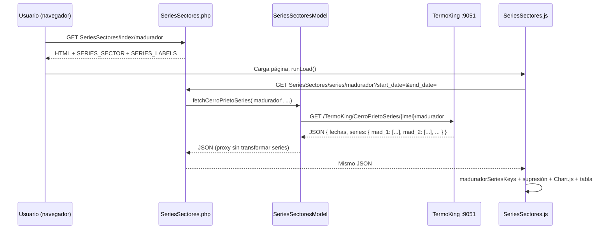
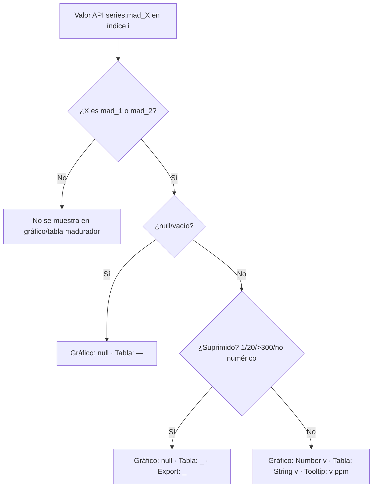

# Traza de procesamiento — Madurador (gráfica y datos)

Documentación de cómo llega la información del **Sistema Madurador** hasta el gráfico histórico, la tabla y las exportaciones en Cerro Prieto.

Este documento se centra en la página **Series históricas → Madurador** (`SeriesSectores/index/madurador`). Al final incluye una nota sobre la tarjeta del **AdminPage** (última trama), que usa otra API y otro flujo.

---

## 1. Resumen ejecutivo

| Aspecto | Comportamiento actual |
|---------|------------------------|
| **Series graficadas** | Solo `mad_1` y `mad_2` |
| **Significado** | `mad_1` = nivel de etileno (ppm); `mad_2` = setpoint de etileno (ppm) |
| **Eje Y** | Único, fijo **0–300 ppm** |
| **Placeholders suprimidos** | `mad_1 === 1` y `mad_2 === 20` → no se grafican; en tabla se muestran como `_` |
| **Fuera de escala** | Valores **> 300 ppm** → igual que placeholders en gráfico/tabla |
| **Otros campos API** | `mad_3` … `mad_18` pueden venir en el JSON; **no** entran al gráfico ni a la tabla del sector madurador |

---

## 2. Flujo de datos (series históricas)



---

## 3. Origen API

### Endpoint externo

```
GET {url_nueva}/TermoKing/CerroPrietoSeries/{imei}/madurador?start_date=&end_date=
```

| Parámetro | Origen |
|-----------|--------|
| `url_nueva` | Config / `.env` (`URL_NUEVA`, p. ej. `http://161.132.53.51:9051`) |
| `{imei}` | Constante `cerro_prieto_series_imei` (`CERRO_PRIETO_SERIES_IMEI`, default `860389053949943`) |
| `start_date`, `end_date` | Opcionales; formato `DD-MM-YYYY_HH-mm-ss`. Si van vacíos, el servicio suele devolver **últimas 12 horas** |

Implementación: `Models/SeriesSectoresModel.php` → `fetchCerroPrietoSeries()`.

### Proxy interno (navegador)

```
GET {base_url}SeriesSectores/series/madurador?start_date=...&end_date=...
```

Implementación: `Controllers/SeriesSectores.php` → `series()`. Valida sector (`madurador` ∈ `series_sectores_permitidos()`), reenvía query string y devuelve el JSON del servicio **sin recalcular** las series en PHP.

### Formato de fechas en el cliente

El input `datetime-local` se convierte en `Assets/js/SeriesSectores.js` con `localInputToApiFormat()`:

```
DD-MM-YYYY_HH-mm-ss
```

Ejemplo: `27-07-2026_14-30-00`.

---

## 4. Estructura de respuesta esperada

Ejemplo conceptual (alineado con `ejemplo_datos.json` y otros sectores):

```json
{
  "code": 200,
  "message": "Series cerro_prieto (madurador) recuperadas.",
  "data": {
    "imei": "860389053949943",
    "sector": "madurador",
    "timezone_datos": "GMT-5",
    "start_date": "2026-06-30T20:00:00",
    "end_date": "2026-06-30T23:56:19",
    "puntos": 42,
    "fechas": [
      "2026-06-30T20:01:00.000000",
      "2026-06-30T20:02:00.000000"
    ],
    "series": {
      "mad_1": [196.6, 1, 185.2],
      "mad_2": [200.0, 20, 200.0],
      "mad_3": [24.0, 24.0, 24.0]
    }
  }
}
```

| Campo | Uso en la UI |
|-------|----------------|
| `fechas[i]` | Eje X del gráfico (tiempo) y primera columna de la tabla |
| `series.mad_1[i]` | Nivel etileno en el instante `i` |
| `series.mad_2[i]` | Setpoint etileno en el instante `i` |
| `series.mad_3` … `mad_18` | Ignorados en gráfico, tabla y export del sector madurador |

La validación mínima antes de pintar: `tieneDatosUtiles()` exige `fechas.length > 0` y al menos una clave en `series`.

---

## 5. Etiquetas (PHP → JavaScript)

Archivo: `Config/Funciones/series_sector_labels.php` → `mapa_etiquetas_series_por_sector('madurador')`.

En la vista `Views/SeriesSectores/index.php` se inyecta:

```javascript
window.SERIES_SECTOR = 'madurador';
window.SERIES_LABELS = { ... };
```

Para el gráfico y la tabla solo importan las claves que el JS decide mostrar; las etiquetas usadas son:

| Clave | Label | Unidad (leyenda) |
|-------|-------|------------------|
| `mad_1` | Etileno | ppm |
| `mad_2` | SP Etileno | ppm |

Función `serieLabel(key)` en `SeriesSectores.js`: concatena label + unidad, p. ej. **「Etileno (ppm)」**.

El mapa PHP sigue definiendo `mad_3` … `mad_18` (modo PLUS / telemetría extendida), pero el frontend **no las incluye** en `MADURADOR_CHART_KEYS`.

---

## 6. Selección de series en el cliente

Constantes en `Assets/js/SeriesSectores.js`:

```javascript
MADURADOR_ETILENO_NIVEL_KEY = 'mad_1'
MADURADOR_ETILENO_SET_KEY   = 'mad_2'
MADURADOR_CHART_KEYS        = ['mad_1', 'mad_2']
```

`maduradorSeriesKeys(seriesObj)` devuelve solo las claves de `MADURADOR_CHART_KEYS` **presentes** en `data.series`.

- Si la API no envía `mad_1` ni `mad_2`, no hay panel de controles útil ni series en gráfico.
- `mad_3` … `mad_18` nunca pasan este filtro.

### Visibilidad (checkboxes)

Tras cada consulta exitosa, `applySuccess()`:

1. `initMaduradorVisibility()` — por defecto **ambas** series visibles (`MADURADOR_DEFAULT_ON`).
2. `renderMaduradorControls()` — panel 「Series en el gráfico (Madurador)」 con grupo 「Etileno (ppm)」.
3. `renderChart()` y `renderTable()` — aplican supresión de valores (sección 7).

---

## 7. Reglas de supresión y valores nulos

Función central: **`maduradorEtilenoValorSuprimido(key, v)`**.

Un valor se trata como **no válido para visualización** cuando:

| Condición | Acción |
|-----------|--------|
| No numérico (`Number(v)` no finito) | Suprimido |
| `n > 300` | Suprimido |
| `key === 'mad_1'` y `n === 1` | Placeholder del equipo → suprimido |
| `key === 'mad_2'` y `n === 20` | Placeholder del equipo → suprimido |

Constantes:

```javascript
MADURADOR_ETILENO_PLACEHOLDER = { mad_1: 1, mad_2: 20 }
MADURADOR_ETILENO_MAX = 300
```

### Gráfico

`yValueMaduradorChart(key, v)`:

- Si la clave no es `mad_1` / `mad_2` → `null`.
- Si vacío / suprimido → `null` (Chart.js **no dibuja punto**; `spanGaps: false` → hueco en la línea).

### Tabla en pantalla

`renderTable()`:

- Suprimido → celda **`_`**
- `null` / `undefined` sin supresión → **`—`**
- Resto → `String(v)` (valor crudo de la API)

### Exportaciones (CSV / Excel / PDF)

`buildSeriesTableMatrix()` usa la **misma lógica** que la tabla: suprimidos → `_`, mismas columnas (`mad_1`, `mad_2` solo).

---

## 8. Construcción del gráfico (Chart.js)

Bloque `if (isMadurador)` en `renderChart()`:

1. **Series activas:** `getMaduradorChartKeys(seriesObj)` (visibilidad + claves presentes).
2. **Por cada clave**, para cada índice `i`:
   - `x` = `new Date(fechas[i])`
   - `y` = `yValueMaduradorChart(key, seriesObj[key][i])`
3. **Estilo:**
   - `mad_1` (Etileno): línea sólida, grosor 1.5
   - `mad_2` (SP Etileno): línea **punteada** (`borderDash: [6, 4]`), grosor 2
4. **Ejes:**
   - X: escala `time` (`timeScaleXAxis()`)
   - Y: lineal **0–300**, título 「Etileno (ppm)」
5. **Tooltip:** `label + ': ' + valor + ' ppm'`; si `y` es null → `—`

No hay ejes secundarios (temperatura, %, CFM): el diseño anterior PLUS en el gráfico fue reemplazado por este modelo solo-etileno.

---

## 9. Tabla de datos y metadatos

| Elemento | Función | Contenido madurador |
|----------|---------|---------------------|
| Meta bajo 「Gráfico」 | `setMeta()` | timezone, `puntos`, rango `start_date → end_date` |
| Tabla | `renderTable()` | Columnas: Fecha/hora + `mad_1` + `mad_2` (si existen en API) |
| Botón 「Ver tabla」 | Toggle `#seriesTableWrap` | Misma matriz que export |
| Export | `exportSeriesTable()` | CSV / XLSX / PDF desde `buildSeriesTableMatrix()` |

Carga inicial: al abrir la página, `onUlt12()` llama `runLoad('', '')` → últimas 12 h sin fechas en query.

---

## 10. Ejemplo de traza punto a punto

Datos API en un instante:

| `fechas[i]` | `mad_1` | `mad_2` |
|-------------|---------|---------|
| `2026-06-30T23:56:19` | `196.6` | `200.0` |

| Paso | `mad_1` | `mad_2` |
|------|---------|---------|
| Valor crudo API | 196.6 | 200.0 |
| ¿Suprimido? | No | No |
| Y en gráfico | 196.6 | 200.0 |
| Celda tabla | `196.6` | `200.0` |
| Leyenda | Etileno (ppm) | SP Etileno (ppm) |

Otro instante con placeholders:

| `mad_1` | `mad_2` |
|---------|---------|
| `1` | `20` |

| Paso | `mad_1` | `mad_2` |
|------|---------|---------|
| ¿Suprimido? | Sí (`=== 1`) | Sí (`=== 20`) |
| Y en gráfico | `null` (hueco) | `null` (hueco) |
| Celda tabla | `_` | `_` |

---

## 11. AdminPage (última trama) — contexto distinto

La tarjeta **Sistema Madurador** del dashboard principal **no** usa `CerroPrietoSeries`.

| | Series (este doc) | AdminPage |
|--|-------------------|-----------|
| API | `CerroPrietoSeries/{imei}/madurador` | `ConsultarUltimaTrama/{imei}` |
| Momento | Histórico (N puntos) | Un solo snapshot |
| Render | Chart.js + tabla JS | HTML server-side |
| Archivo PHP | `SeriesSectoresModel.php` | `generarTarjetaMadurador()` en `generales.php` |

### Modo clásico (≤ 6 campos `mad_*`)

`generarTarjetaMadurador()` formatea:

| Campo | UI | Formato |
|-------|-----|---------|
| `mad_1` | Etileno | ppm (0–250 en `formatearCampoMadPlus`) |
| `mad_2` | SP Etileno | ppm |
| `mad_3` | Tiempo Programado | horas |
| `mad_4` | Hora | 0–23 h |
| `mad_5` | Minuto | min |
| `mad_6` | Segundo | s |

### Modo PLUS (> 6 campos)

`generarTarjetaMaduradorPlus()` — telemetría ampliada (`mad_1` POWER … `mad_18` PPM etileno en tarjeta). El gráfico histórico **no** refleja ese modo: sigue limitado a `mad_1` / `mad_2` como etileno.

---

## 12. Archivos de referencia

| Archivo | Rol |
|---------|-----|
| `Controllers/SeriesSectores.php` | Ruta `series/madurador`, proxy JSON |
| `Models/SeriesSectoresModel.php` | cURL a `CerroPrietoSeries` |
| `Config/Funciones/series_sector_labels.php` | Etiquetas `SERIES_LABELS` |
| `Views/SeriesSectores/index.php` | Vista, panel madurador, script de sector |
| `Assets/js/SeriesSectores.js` | Supresión, gráfico, tabla, export |
| `Config/Funciones/generales.php` | Tarjeta madurador AdminPage (no histórico) |
| `ejemplo_datos.json` | Ejemplo de respuesta de series (otro sector; misma forma) |

---

## 13. Diagrama de decisión (valor → UI)



---

*Documento generado según el código en `SeriesSectores.js` y flujo Cerro Prieto. Ante cambios en placeholders o rango ppm, actualizar `MADURADOR_ETILENO_PLACEHOLDER` y `MADURADOR_ETILENO_MAX` en el JS.*
